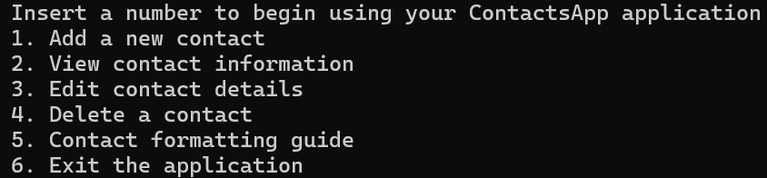

# ContactsApp

ContactsApp is an application where users can create, read, update and delete
Finnish contacts. Contacts are stored in a persistent text file.

The project was coded in Java and built using Visual Studio Code.

# Motivation

ContactsApp serves as a final project for the Introduction to programming course.
My motivation for this program was to learn to work with persistent text files,
improve my Java coding skills and the quality of my code.

# How to use?

i. Compiling and running the application.

Go to the javaproject folder through the terminal with:

cd your/downloaded/path/javaproject/src

The src folder contains the Java files. Compile and run the application with
the following command:

javac *.java && java ContactsApp

ii. User menu

After compiling and running the application - the user menu will display
user prompts to the standard output. Input numbers according to the user prompts
to navigate through the program.

Insert one of these numbers to begin using your ContactsApp application:
1.Add a new contact:
Input 1. to add a new contact according to the instructions printed to standard output.

2.View contact information:
Input 2. to view currently stored contact information as a contact list.

3.Edit contact details:
Input 3. to edit contact details from a specific contact according to the
instructions printed to standard output.

4.Delete a contact:
Input 4 to delete contacts from the contact list according to the instructions
printed to standard output.

5.Contact formatting guide:
Input 5 to access the contact formatting guide that acts as a user tutorial
in the contact creation process.

6.Exit the application:
Input 6 to shut down and exit the application.

# Credits
Tutorials that I have implemented onto my program.
Hopefully these links will help someone else too:

How to create and read files:

https://www.w3schools.com/java/java_files_create.asp
https://www.w3schools.com/java/java_files_read.asp

String validation:

https://developer.mozilla.org/en-US/docs/Web/JavaScript/Reference/Global_Objects/String/startsWith
https://stackoverflow.com/questions/8204680/java-regex-email

Arraylist:

https://www.w3schools.com/java/java_arraylist.asp
https://www.geeksforgeeks.org/arraylist-get-method-java-examples/
https://www.geeksforgeeks.org/remove-an-element-at-specific-index-from-an-array-in-java/
https://www.w3schools.com/java/ref_arraylist_remove.asp
